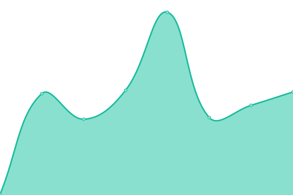

# [📈 Live Status](https://doctorfree.github.io/upptime): <!--live status--> **🟧 Partial outage**

This repository contains the open-source uptime monitor and status page for [Ronald Record](http://ronrecord.com), powered by [Upptime](https://github.com/upptime/upptime).

With [Upptime](https://upptime.js.org), you can get your own unlimited and free uptime monitor and status page, powered entirely by a GitHub repository. We use [Issues](https://github.com/doctorfree/upptime/issues) as incident reports, [Actions](https://github.com/doctorfree/upptime/actions) as uptime monitors, and [Pages](https://doctorfree.github.io/upptime) for the status page.

<!--start: status pages-->
<!-- This summary is generated by Upptime (https://github.com/upptime/upptime) -->
<!-- Do not edit this manually, your changes will be overwritten -->
<!-- prettier-ignore -->
| URL | Status | History | Response Time | Uptime |
| --- | ------ | ------- | ------------- | ------ |
|  [asciiville.dev](https://asciiville.dev) | 🟩 Up | [asciiville-dev.yml](https://github.com/doctorfree/upptime/commits/HEAD/history/asciiville-dev.yml) | 

 117ms
     
 | 

<a href="https://doctorfree.github.io/upptime/history/asciiville-dev">100.00%</a>
    

|  [lazyman.dev](https://lazyman.dev) | 🟩 Up | [lazyman-dev.yml](https://github.com/doctorfree/upptime/commits/HEAD/history/lazyman-dev.yml) | 

 115ms
     
 | 

<a href="https://doctorfree.github.io/upptime/history/lazyman-dev">100.00%</a>
    

|  [skunkware.dev](https://skunkware.dev) | 🟩 Up | [skunkware-dev.yml](https://github.com/doctorfree/upptime/commits/HEAD/history/skunkware-dev.yml) | 

 146ms
     
 | 

<a href="https://doctorfree.github.io/upptime/history/skunkware-dev">100.00%</a>
    

|  [musicplayerplus.dev](https://musicplayerplus.dev) | 🟩 Up | [musicplayerplus-dev.yml](https://github.com/doctorfree/upptime/commits/HEAD/history/musicplayerplus-dev.yml) | 

 114ms
     
 | 

<a href="https://doctorfree.github.io/upptime/history/musicplayerplus-dev">100.00%</a>
    

|  [mirrorcommand.dev](https://mirrorcommand.dev) | 🟩 Up | [mirrorcommand-dev.yml](https://github.com/doctorfree/upptime/commits/HEAD/history/mirrorcommand-dev.yml) | 

 133ms
     
 | 

<a href="https://doctorfree.github.io/upptime/history/mirrorcommand-dev">100.00%</a>
    

|  [neoman.dev](https://neoman.dev) | 🟥 Down | [neoman-dev.yml](https://github.com/doctorfree/upptime/commits/HEAD/history/neoman-dev.yml) | 

 0ms
     
 | 

<a href="https://doctorfree.github.io/upptime/history/neoman-dev">0.00%</a>
    

|  [rooncommand.dev](https://rooncommand.dev) | 🟩 Up | [rooncommand-dev.yml](https://github.com/doctorfree/upptime/commits/HEAD/history/rooncommand-dev.yml) | 

 118ms
     
 | 

<a href="https://doctorfree.github.io/upptime/history/rooncommand-dev">100.00%</a>
    

|  [ronrecord.com](https://ronrecord.com) | 🟩 Up | [ronrecord-com.yml](https://github.com/doctorfree/upptime/commits/HEAD/history/ronrecord-com.yml) | 

 1538ms
     
 | 

<a href="https://doctorfree.github.io/upptime/history/ronrecord-com">100.00%</a>
    

|  [willowrecord.com](https://willowrecord.com) | 🟩 Up | [willowrecord-com.yml](https://github.com/doctorfree/upptime/commits/HEAD/history/willowrecord-com.yml) | 

 420ms
     
 | 

<a href="https://doctorfree.github.io/upptime/history/willowrecord-com">99.91%</a>
    

|  [subtime.ronrecord.com](https://subtime.ronrecord.com) | 🟩 Up | [subtime-ronrecord-com.yml](https://github.com/doctorfree/upptime/commits/HEAD/history/subtime-ronrecord-com.yml) | 

 412ms
     
 | 

<a href="https://doctorfree.github.io/upptime/history/subtime-ronrecord-com">100.00%</a>
    

<!--end: status pages-->

[**Visit our status website →**](https://doctorfree.github.io/upptime)

## 📄 License

- Powered by: [Upptime](https://github.com/upptime/upptime)
- Code: [MIT](./LICENSE) © [Ronald Record](http://ronrecord.com)
- Data in the `./history` directory: [Open Database License](https://opendatacommons.org/licenses/odbl/1-0/)
